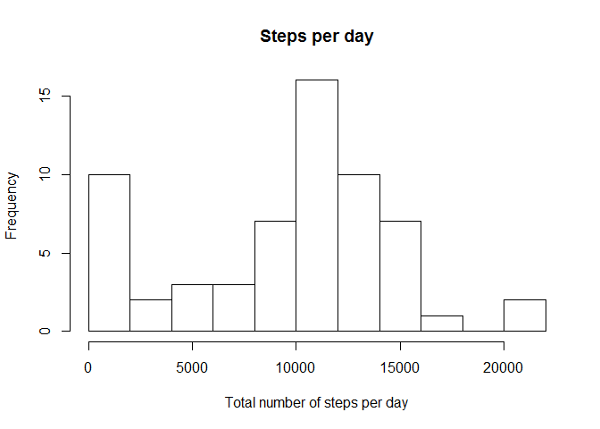
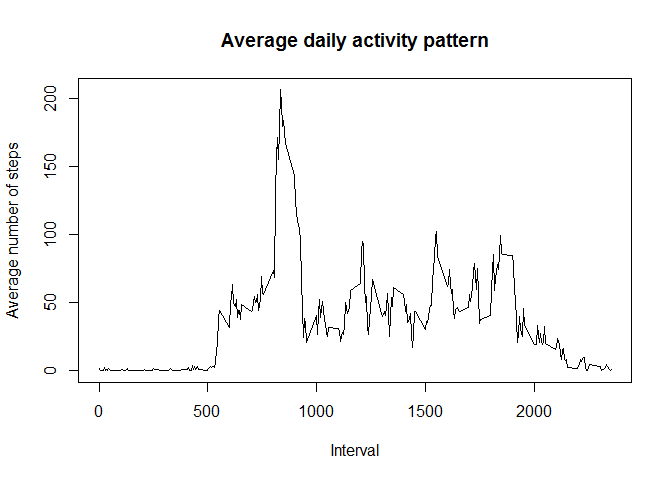
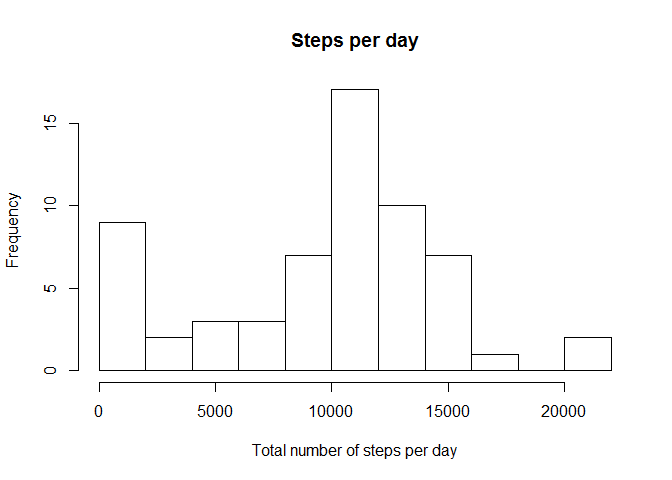
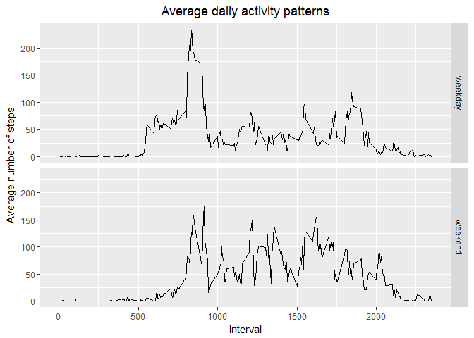

```r
library(ggplot2)
```

## Loading and preprocessing the data


```r
data <- read.csv("activity.csv",na.strings = "NA", header = TRUE)
```

## What is mean total number of steps taken per day?

Here is a histogram of the total number of steps taken per day:


```r
steps_per_day <-aggregate(data$steps, by=list(data$date), FUN=sum, na.rm=TRUE)
names(steps_per_day) <- c("Date","Total_number_of_steps")

hist(steps_per_day$Total_number_of_steps,breaks=10, 
     xlab ="Total number of steps per day",
     main="Steps per day")
```

<!-- -->

The mean and the median total number of steps per day are


```r
mean(steps_per_day$Total_number_of_steps)
```

```
## [1] 9354.23
```

and


```r
median(steps_per_day$Total_number_of_steps)
```

```
## [1] 10395
```

## What is the average daily activity pattern?


```r
avg_steps_per_interval <- aggregate(data$steps, by=list(data$interval), FUN=mean, na.rm=TRUE)
names(avg_steps_per_interval) <- c("Interval","Average_number_of_steps")

plot(avg_steps_per_interval,
     type="l",
     ylab="Average number of steps",
     main="Average daily activity pattern")
```

<!-- -->

The 5-minute interval which on average (across all the days in the dataset) contains the maximum number of steps is


```r
avg_steps_per_interval[which(avg_steps_per_interval$Average_number_of_steps
                             ==max(avg_steps_per_interval$Average_number_of_steps)),1]
```

```
## [1] 835
```

## Imputing missing values

The number of rows containiing missing values is


```r
dim(data[!complete.cases(data), ])[1]
```

```
## [1] 2304
```

If missing values are filled in, the above histogram of steps per day changes to 


```r
data_with_missings_filled_in       <- data
data_with_missings_filled_in$steps <- ifelse(is.na(data_with_missings_filled_in$steps), 
                                             avg_steps_per_interval[which(avg_steps_per_interval$Interval
                                             ==data_with_missings_filled_in$interval),2],
                                             data_with_missings_filled_in$steps)

steps_per_day_new <-aggregate(data_with_missings_filled_in$steps, 
                              by=list(data_with_missings_filled_in$date), FUN=sum, na.rm=TRUE)
names(steps_per_day_new) <- c("Date","Total_number_of_steps")

hist(steps_per_day_new$Total_number_of_steps,breaks=10,
     xlab ="Total number of steps per day",
     main="Steps per day")
```

<!-- -->

The mean and the median total number of steps per day increase to


```r
mean(steps_per_day_new$Total_number_of_steps)
```

```
## [1] 9530.724
```

```r
median(steps_per_day_new$Total_number_of_steps)
```

```
## [1] 10439
```

## Are there differences in activity patterns between weekdays and weekends?


```r
data$weekday <- ifelse(weekdays(as.Date(data$date)) %in% c("Saturday","Sunday"),"weekend","weekday")
data$weekday <- as.factor(data$weekday)

avg_steps_per_interval_w <- aggregate(data$steps, by=list(data$interval,data$weekday), FUN=mean, na.rm=TRUE)
names(avg_steps_per_interval_w) <- c("Interval","Weekday","Average_number_of_steps")

ggplot(avg_steps_per_interval_w, aes(x=Interval, y=Average_number_of_steps)) +
    geom_line()+
    facet_grid(Weekday~.)+
    labs(title="Average daily activity patterns")+
    labs(y="Average number of steps")+
    theme(plot.title = element_text(hjust = 0.5))
```

<!-- -->
